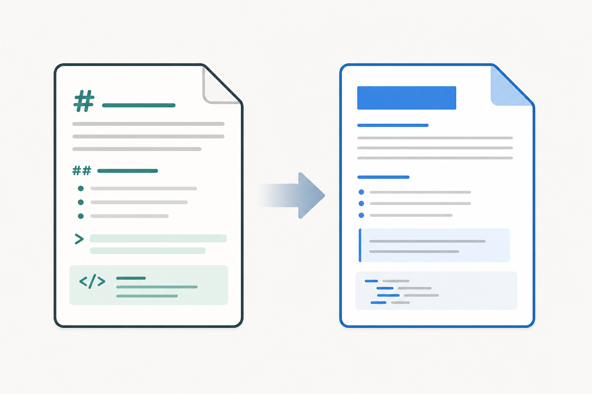

# VMF Studio Publisher PoC

This paragraph verifies **bold**, *italic*, ***bold italic***, and an
[inline link](https://example.com) in normal paragraph text.

This paragraph verifies __underscore bold__, _underscore italic_, and
___underscore bold italic__ syntax. Escaped markers remain plain characters:
\*not italic\*, \_not italic\_, and \[not a link\].

## **Styled heading** with _italic text_ and an [inline link](https://example.com/heading)

## Live verification checklist

- **Unordered level one** uses a disc.
  - _Unordered level two_ uses a circle.
    - ***Unordered level three*** uses a square.
      - [Unordered level four](https://example.com/unordered) remains nested.
1. **Ordered level one** uses a decimal marker.
  1. _Ordered level two_ uses an alpha marker.
    1. [***Ordered level three***](https://example.com/ordered) uses a Roman marker.
- A **mixed list** starts with an unordered item.
  1. Its _second level_ is ordered.
    - Its [**third level** returns to unordered](https://example.com/mixed).
      1. Its ___fourth level___ returns to ordered.

This **styled paragraph follows the list** and verifies that its position and
inline ranges are preserved after leading list tabs are removed.

## Markdown table verification

The paragraph before this table verifies that the preceding ordinary batch is
closed before table insertion.

| Name                            | Status |   Note |
| ------------------------------- | :----: | -----: |
| **Publisher**                   | Active | *v1.0* |
| [Renderer](https://example.com) |  Ready |   100% |
| Empty                           |        |  Right |

This **styled paragraph follows the table** and verifies that its position is
derived from the table EndIndex returned by Google Docs.

The following table omits its outer pipes:

Name | Status | Note
--- | :---: | ---:
Parser | Ready | Right
Escaped pipe | A \| B | Safe

## `Code and Quote` verification

Use `dotnet test` before publishing. The inline code must use Roboto Mono and a
light gray background without interpreting Markdown markers.

```csharp
var text = "**not bold**";
Console.WriteLine(text);
```

### Heading with `inline code`

- A list item runs `dotnet test` before publishing.
  1. A nested list item keeps **bold `inline code`** aligned after tab removal.

| Context    | Example                         | Result |
| ---------- | :-----------------------------: | -----: |
| Table code | `dotnet test`                   | Styled |
| Overlap    | **`bold code`**                 | Styled |
| Link       | [`linked code`](https://example.com/code) | Styled |

> A quoted paragraph with **bold** and `inline code`.
>> A nested quote with [a link](https://example.com).
>>> Quote level three.
>>>> Quote level four.
>>>>> Quote level five.
>>>>>> Quote level six with `inline code`.
 >>>>>>> Quote level seven is normalized to level six.
>
> The empty quote line above remains present.

After quote.

## Image publishing verification

The paragraph before the local image verifies that the ordinary batch is closed
before local-image hosting and insertion.



This paragraph follows the local image and verifies that its position comes from
the image paragraph EndIndex returned by Google Docs.


This paragraph follows the remote image and verifies that redirect-safe remote
metadata inspection and the image paragraph EndIndex preserve subsequent text.

Malformed constructs remain literal text: **unclosed bold, [](https://example.com),
and [invalid URL](relative/path). Empty inline code `` and `unclosed inline code
remain ordinary text without terminating publication.
